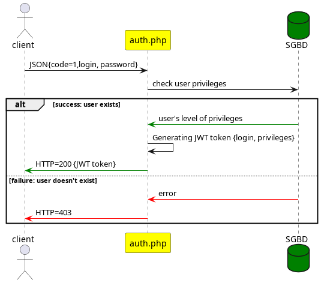
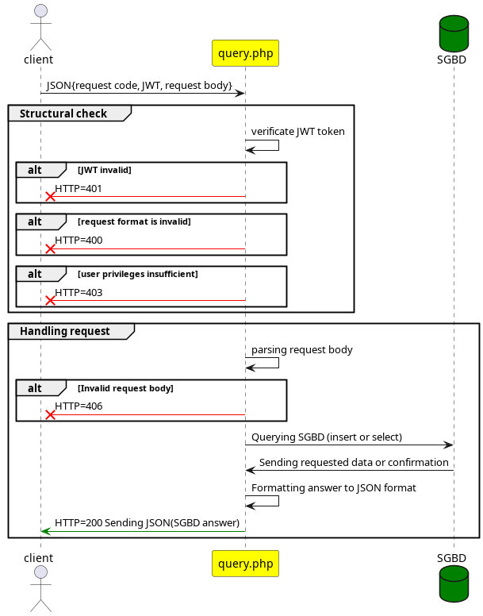

= API Mamazon
Léo Chéneau
v1.1 2022-10-01
:doctype: report
:toc: macro
:toc-title: Tables des matières
:toclevels: 3
:source-highlighter: highlight.js
:highlightjs-theme: googlecode
:stem: latexmath
:data-uri:

API d'intercommunication entre les interfaces et le backend.

== Entrées / Sorties

=== JSON

Les entrées se font **toujours** en _JSON_.

Format d'un message à l'API.

[source, json]
----
{
    "code": 0, /* int: API code */
    "token": "xxxx", /* string: JWT token */
    "content": {
        /* request content */
        "property": value
    }
}
----

Les réponses sont au format JSON si succès.

=== Pages

L'API est comprise de deux pages : 

* `auth.php` pour l'authentification.

* `query.php` pour les requêtes à l'API

=== Erreurs

Une erreur sera signifiée par un code d'erreur HTTP 4XX.

=== Connexion et sécurité

Afin de garantir la sécurité, les clients doivent s'authentifier via la page `auth.php` et récupérer un JWT.

=== Requêtes

== Accès direct au SGBD

.... à venir
