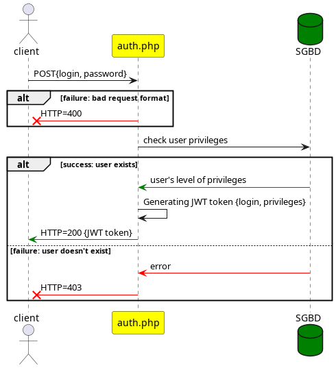

= API Mamazon
Léo Chéneau
v1.1 2022-10-01
:doctype: report
:toc: macro
:toc-title: Tables des matières
:toclevels: 3
:source-highlighter: rouge
:stem: latexmath
:data-uri:

API d'intercommunication entre les interfaces et le backend.

== Entrées / Sorties

=== JSON

Les entrées se font **toujours** en _JSON_.

Format d'un message à l'API.

[source, json]
----
{
    "code": 0, /* int: API code */
    "token": "xxxx", /* string: JWT token */
    "content": {
        /* request content */
        "property": value
    }
}
----

Les réponses sont au format JSON si succès.

=== Pages

L'API est comprise de deux pages : 

* `auth.php` pour l'authentification.

* `query.php` pour les requêtes à l'API

=== Erreurs

Une erreur sera signifiée par un code d'erreur HTTP 4XX.

=== Connexion et sécurité

Afin de garantir la sécurité, les clients doivent s'authentifier via la page `auth.php` et récupérer un https://jwt.io/[JWT]. Ces accès se font via une connexion TLSv3. Les champs `username` et `password` sont à envoyer par requête POST. La page répond un JWT brut (texte) si les informations sont correctes et renvoie une erreur dans le cas contraire.

=== Requêtes

Les requêtes sont à envoyer au format JSON à la page `query.php`. Toute requête doit posséder un champ _code_ et _token_ (obtenu depuis `auth.php`). Le serveur répond par un fichier JSON ou bien par une erreur si un problème est survenu.

== Accès direct au SGBD

Le SGBD est une base de données MariaDB, contacter @cheneau pour les accès directs.

== Liste des requêtes et réponses

=== Introduction

Chaque type requête et chaque type de réponse possède un code. Les requêtes possèdent un code impair, les réponses des codes pairs. +
Ce code est présent dans le champ `code` au niveau le plus élevé du JSON.
Chaque requête doit posséder un champ `token` contenant un JWT obtenu depuis la page **auth.php**.

Les champs mentionnés plus bas sont ceux du super-champ `content`.

=== Réponse du serveur à ajout (code 0)

Réponse renvoyée par le serveur après une tentative d'ajout.

NOTE: Si tout s'est bien passé le code HTTP 200 est envoyé. Dans ce cas, il n'est pas nécessaire de parser cette réponse.

.Champs
|===
| **Nom** | Type | Valeur
| success | _int[0 ou 1]_ | Succès de l'opération, 1 = succès, 0 = échec
| message | _string_ | Message contenant plus d'informations
|===

.Exemple
****
[source, json]
----
{
    "code": 0,
    "content": {
    	"success": 0,
	"message": "Invalid token"
    }
}
----
****

=== Ajout d'un objet (code 1)

Requête ajoutant un objet au stock.

.Champs
|===
| **Nom** | Type | Valeur
| warehouse | _string_ | Code magasin
| location | **JSON** | emplacement
| location.allee | _string_ | allée
| location.travee | _string_ | travée
| location.niveau | _string_ | niveau
| location.alveole | _string_ | emplacement dans l'avéole
| product | _string_ | code produit
| qantity | _int_ | quantité
|===

.Exemple
****
[source, json]
----
{
    "code": 1,
    "token": "VALID",
    "content": {
    		"warehouse": "MAG1",
		"location": {
			"allee": "A",
			"travee": "02",
			"niveau": "02",
			"alveole": "03",
		},
		"product": "E961307",
		"quantity": 100
    }
}
----
****

=== Réponse du serveur à ajout (code 2)

Réponse renvoyée par le serveur après une demande des noms d'entrepôts.

.Champs
|===
| **Nom** | Type | Valeur
| list | _array[string]_ | Liste des noms
|===

.Exemple
****
[source, json]
----
{
    "code": 2,
    "content": {
    	"list": [
		"A",
		"B"
	]
     }
}
----
****

=== Demande des noms des entrepôts (code 3)

Demande le nom des entrepôts (warehouse)

.Champs
|===
| **Nom** | Type | Valeur
|===

Le serveur répond avec un JSON de code 2.

.Exemple
****
[source, json]
----
{
    "code": 3,
    "token": "VALID",
    "content": {

    }
}
----
****
=== Requêtes nécessaires à InventoryManagement

**à vous de me dire**
